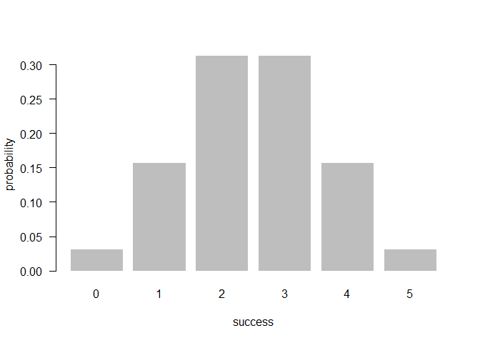
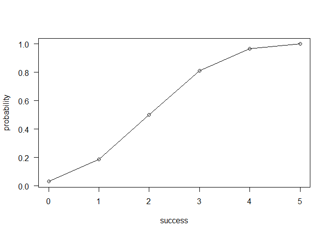

Overview
--------

`"binomial"` is an R package that provides functions to calculate the probability of binomial random variable. And the package also provides functions to calculte other related property of binomial random variable.

-   `bin_choose()` calculates the number of combinations in which `"k"` success can occur in `"n"` trials

-   `bin_probability()` caculates the binomial probability of `"k"` success in `"n"` trials given `"p"` probability

-   `bin_distribution()` list the probabality of each successe with probability `"p"` in `"n"` trials

    -`plot()` method for a `bin_distribution()` to grphs a barplot to display a histogram of a distribution of variables

-   `bin_cumulative()` list the cumulative probabality of each successe with probability `"p"` in `"n"` trials

    -`plot()` method for a `bin_cumulative()` to display a plot of a cumulative distribution object

-   `bin_variable()`list the class binomial random variable with the named of `"trials"` and `"prob"`

    -`summary()`method for a `bin_variable()` ethod to give a full summary description of an object

-   `bin_mean()` calculate the mean of a binomal distribution

-   `bin_variance()` calculate the variance of a binomal distribution

-   `bin_mode()` calculate the mode of a binomal distribution

-   `bin_skewness()` calculate the skewness of a binomal distribution

-   `bin_kurtosis()` calculate the kurtosis of a binomal distribution

Motivation
----------

Through this package, we will learn how to make r pakages with various calculations related to binomial functions.

Installation
------------

Install the development version from GitHub via the package `"devtools"`:

``` r

# development version from GitHub:
#install.packages("devtools")


# install "cointoss" (without vignettes)
devtools::install_github("stat133-sp19/hw-stat133-jsbshin/binomial")


# install "cointoss" (with vignettes)
devtools::install_github("stat133-sp19/hw-stat133-jsbshin/binomial", build_vignettes = TRUE)
```

Usage
-----

``` r
library(binomial)

#the number of combinations in which k success can occur in n trials
choose <- bin_choose(n = 5, k = 2)
choose
#> [1] 10


# binomial random variable
variable <- bin_variable(trials = 5, prob = 0.5)
variable
#> "Binomail variable"
#> 
#> Parameters
#> - number of trials: 5 
#> - prob of success : 0.5

# binomial probability
bin_probability(success = 2, trials = 5, prob = 0.5)
#> [1] 0.3125
bin_probability(success = 0:2, trials = 5, prob = 0.5)
#> [1] 0.03125 0.15625 0.31250

# binomial distribution
dist <- bin_distribution(trials = 5, prob = 0.5)
dist
#>   success probability
#> 1       0     0.03125
#> 2       1     0.15625
#> 3       2     0.31250
#> 4       3     0.31250
#> 5       4     0.15625
#> 6       5     0.03125

# binomial ditribution plot
plot(dist)
```




``` r
# binomial cumulative distribution
cum <- bin_cumulative(trials = 5, prob = 0.5)
cum
#>   success probability cumulative
#> 1       0     0.03125    0.03125
#> 2       1     0.15625    0.18750
#> 3       2     0.31250    0.50000
#> 4       3     0.31250    0.81250
#> 5       4     0.15625    0.96875
#> 6       5     0.03125    1.00000
```

``` r
# binomial cumulative distribution plot
plot(cum)
```




``` r
# binomial random variable summary statistics
bin1 <- bin_variable(trials = 10, p = 0.3) 
binsum1 <- summary(bin1) 
binsum1
#> "Summary Binomial" 
#> 
#> Parameters 
#> - number of trials: 10 
#> - prob of success : 0.3 
#> 
#> Measures 
#> - mean    : 3 
#> - variance: 2.1 
#> - mode    : 3 
#> - skewness: 0.2760262 
#> - kurtosis: -0.1238095


# summary measures
bin_mean(10, 0.3) 
#> [1] 3
bin_variance(10, 0.3) 
#> [1] 2.1
bin_mode(10, 0.3) 
#> [1] 3
bin_skewness(10, 0.3) 
#> [1] 0.2760262
bin_kurtosis(10, 0.3) 
#> [1] -0.1238095
```
