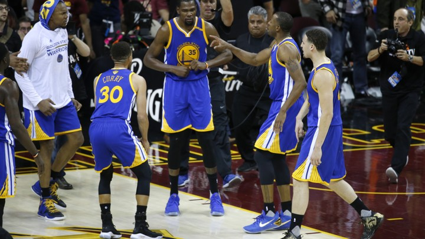
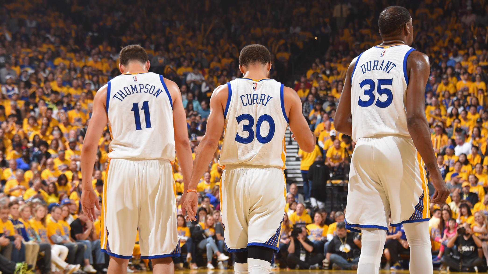
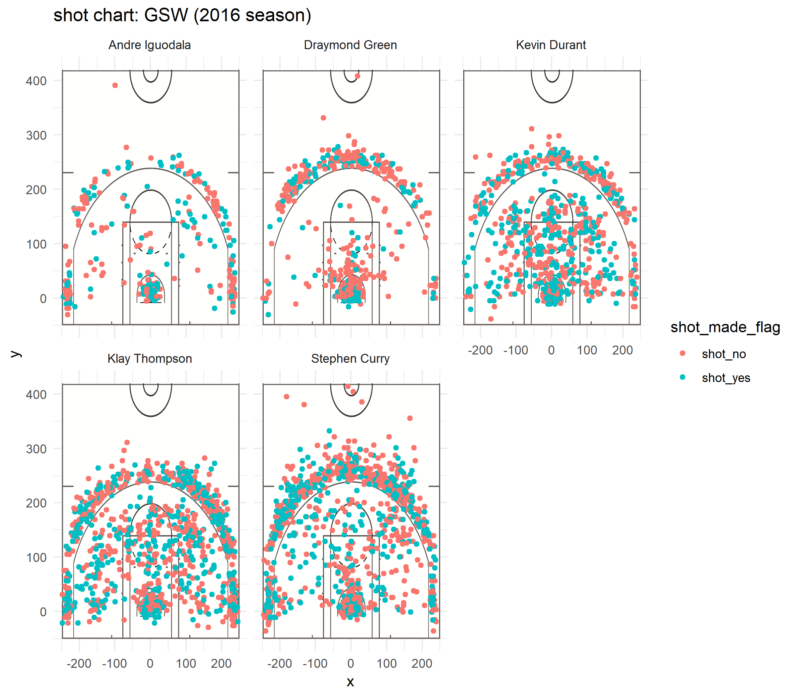

```{r setup, include=FALSE}
knitr::opts_chunk$set(echo = TRUE)
library(dplyr)
library(grid)
library(gridExtra)

```


#NBA superteam -- Golden State Warriors, best shooting team in NBA

##Introduction
The Golden State Warriors, who have the best splash duo of Curry and Tomson, have signed superstar Kevin Durant ahead of the 2016-2017 season. Golden State was the best three-point team without Durant. Due to Durant's joining, Golden State had Fantastic Four with Curry, Tomson, Green, and Durant. Golden State won the 2016-2017 season by defeating LeBron James's Cleveland through outstanding performance of fantastic four. In fact, Iguodala and Green have some bad shooting skills. Instead, they have excellent defense and high bq. But how could Golden Stay be the best shooting team? Let's analyze the shooting data for Curry, Tomson, Durant, Green, and Iguodala this season. Based on this, let's see how they became the best shooting team in NBA.

```{r out.width='80%', echo = FALSE, fig.align= 'center'}

```


Tony Pesta, a site expert at BlueManHoop for the Golden State Warriors stated that,

> "From top to bottom, the Golden State Warriors roster consists of some of the greatest shooters in the world. Because of this, the team has been on the frontier of the 3-point revolution. Every franchise in the NBA is attempting to recreate the system that the Warriors have created."


##Analysis

We're going to look *effective shooting* data of five players.

__Table1: 2PT Effective Shooting % by Player__
```{r echo = FALSE}
shots_data <- read.csv(file = "../data/shots-data.csv")
two_point <- filter(shots_data, shot_type == "2PT Field Goal")
two_point <- summarise(
  group_by(two_point, name),
  TotalShots = sum(shot_type == "2PT Field Goal"),
  ShotsMade = sum(shot_made_flag == "shot_yes"),
  PercentMade = ShotsMade / TotalShots
)
two_point <- arrange(two_point, desc(PercentMade))
knitr::kable(two_point)
```

As you can see, Kevin Durant had the most 2 pt field goals and Iguodala had the lowest 2 pt field goals. From this data, we can see that Kevin Durant used his height to make a highly percentage of 2 pt field goals. And Iguodala had the lowest score, but he had the highest percentage because he usually attempted the shot when he had a perfect chance. And the team's main scorer Curry and Thopson, the splash duo, also scored a lot and had a good field goals percentage. Even the Green, who has poor shooting ability, has made 49% of 2pt field goals rate. It shows that how good the Warrios's 2pt filed goal rate is.


```{r out.width='80%', echo = FALSE, fig.align= 'center'}
knitr::include_graphics("../images/image2.jpg")
```


__Table2: 3PT Effective Shooting % by Player__
```{r echo = FALSE}
shots_data <- read.csv(file = "../data/shots-data.csv")
three_point <- filter(shots_data, shot_type == "3PT Field Goal")
three_point <- summarise(
  group_by(three_point, name),
  TotalShots = sum(shot_type == "3PT Field Goal"),
  ShotsMade = sum(shot_made_flag == "shot_yes"),
  PercentMade = ShotsMade / TotalShots
)
three_point <- arrange(three_point, desc(PercentMade))
knitr::kable(three_point)
```


The table above shows that Golden State has two of the best three-point shooters in the league. Curry made 280 3pt shots on 687 attempts and Thompson made 246 3pt shots on 580 attempts. Despite the many 3pt shot attempts, both showed a great 3pt shot made percentage that Curry got 40% and Thompson got 42%. And also, 7-foot-tall 3pt shooter Kevin Durant, who was recruited this season, made 105 3pt shots with 38% of shots made rate. With Kevin Durant, Golden State Warriors's outside shots are become even stronger, and it showing that why this team has won this season. Iguodala had 58 3pt shots, and Green had 74 3pt shots. They had fewer 3-point attempts than the other three players, and their success rate stayed in the mid-30s.


```{r out.width='80%', echo = FALSE, fig.align= 'center'}

```


__Table3: Effective Shooting % by Player__

```{r echo = FALSE}
all_points <- summarise(
  group_by(shots_data, name),
  TotalShots = sum(shot_type == "3PT Field Goal" | shot_type == "2PT Field Goal"),
  ShotsMade = sum(shot_made_flag == "shot_yes"),
  PercentMade = ShotsMade / TotalShots
)
all_points <- arrange(all_points, desc(PercentMade))
knitr::kable(all_points)
```


Durant tried 915 shots and made 495 shots, showing the highest effective shooting rate of 54%. He has a high 54% effective shooting rate despite his 272 3pt shot attempts in 915 shooting attempts. This shows his high shooting ability. And super star Curry tried 1250 shots and made 584 shots with 46.7% of effective shooting rate. Curry tried 1250 shots shows that he is the team's most important attack option, and with a high success rate of 46.7% indicates that why he is the best shooter in the league. Another important attack option, Thompson, had 575 shots out of 1220 shooting attempts, showing a 47% effective shooting rate. Iguodala did not try many shots with 371, but showed a high effective shooting rate of 51.8%. This shows that Iguodala had a high probability of attack in perfect chances.


####__Players shot chart__
```{r out.width='80%', echo = FALSE, fig.align= 'center'}

```


This chart shows that the position of the shoot attempts and success of each players. Green is success of shots and red is fail of shots. Especially for curry's shot chart, there are lots of green dots behind the 3pt line. It shows that why Stephen Curry is best 3pt shooter in NBA.


##**Conclusion**

```{r out.width='80%', echo = FALSE, fig.align= 'center'}
knitr::include_graphics("../images/image4.jpg")
```


As you can see from the charts and tables, the Golden State Warriors are nba's best shooting team in NBA.The 200 3pt shoots made mean that the best 3-point shooter in the league.Curry, who made 280 points,is the superstar and the best three-point shooter in the league. Thompson, who also made 246 3-point shots here, supports Curry. Both of them showed a high effective shooting rate of 46.7% and 47.1% at the same time as many shoot successes. Another superstar, Durant, showed a high shooting success rate of 54%, regardless of the inside or outside field goals. Green and Iguodala, who do not have great offensive ability, but who had strong defensive ablility, support the team with a good effective shooting rate. The characteristics of these players were well combined and warriors was able to win the 2016-2017 season. the Warriors will be the strongest contenders in the future.


##**Reference**
* [Golden State Warriors: Who is the best shooter on the team?](https://bluemanhoop.com/2018/09/27/golden-state-warriors-best-shooter-team/)